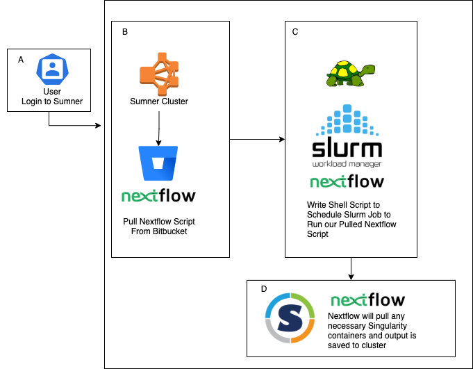
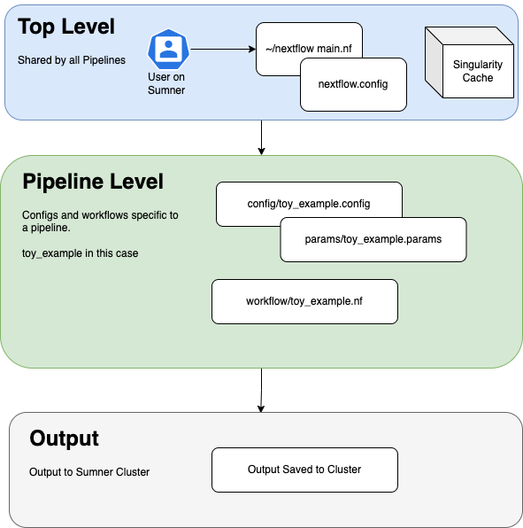

<h1 style="text-align:center;">JAX Nextflow DSL2 Pipelines</h1>

From this repo you will be able to utilize all of the production pipelines. For JAX pipeline development we will be working with Nextflow in order to standardize and modularize the use of Singularity containers.
  
In essence, Nextflow is a wrapper for working with linux containers. This repo requires using Nextflow's Domain Specific Language 2 (DSL2). See <a href="#additional_references">Additional References</a> for more information.  
Singularity containers are found on Sumner at /projects/compsci/nextflow/containers  
Alternatively, they can be found in the cloud at ** Add repo here **
  

Please see the following doccumentation for working with each pipeline.
<ul>
<li><a href = "/rnaseq/README.md">RNA Sequencing (RNASeq)</a></li>
<li><a href = "#">Whole Genome Sequencing (WGS)</a></li>
<li><a href = "#">Whole Exome Sequencing (WES)</a></li>

</ul>

# General Workflow

<h1 style="text-align:center;">Toy Example</h1>

We have set up a "toy_example" in order to make this repo more transparent and to standardize development. The toy_example is simple, it trims RNASeq reads using Trimmomatic then does an expression analysis using RSEM.
  

  
### General Files Used By All Pipelines

<ul>
<li>
<a href="">main.nf</a> 
This is the script that you will call once you have defined which pipeline it is that you wish to run in the nextflow.config file.  
</li>
<li><a href="">nextflow.config</a> 
nextflow.config is where you will define which pipeline you are to run as well as a few of the required paramiters shared by all pipelines.
</li>
</ul>

### Files Specific to Toy Example
<ul>

<li><a href="">config/toy_example.config</a> 
The config folder holds all of the configuration files for each pipeline. The configuration files define file paths and variables to be used.  </li>

<li><a href="">config/params/toy_example.yaml</a> 
The params folder houses the yaml files that can extend the config file. These files define parameters such as file paths and variables to be used by a process. This is a place where optional changes typically live.  </li>

<li><a href="">workflows/toy_example.nf</a> 
Workflows are the heart of the Nextflow process. This is where modules are called and the order of operations are defined. Workflows can further call sub-workflows if there are tasks shared by multiple pipelines.</li>

</ul>

### How to Run Toy Example on Sumner

<ol>
</li>

<li>SSH into Sumner 
  <code>
  ssh login.sumner.jax.org
  </code>
</li>

<li>Install Nextflow in Home Directory 
  <a href="">See This Documentation</a>
</li>

<li>Start Session on Compute Node 
  <code>srun -p compute -t 02:00:00 --mem 2G -n 2 --pty bash </code>
</li>

<li>Load Singularity 
  <code>ml singularity</code>
</li>

<li>Clone Repo (or Pull Updated Repo) 
  <code>
  cd /your/directory

  git clone https://dirName
  </code>
</li>

<li>Go to Repo Directory 
  <code>cd dirName</code>
</li>

<li>Make Changes to nextflow.config File 
  <code>nano nextflow.config</code> 
  **Add Image of Changes to Be Made ** 
  Save Changes: Press "ctr+x" Followed by "y" and hit "Enter"
</li>
<li>Run the Script 
  <code>~/nextflow main.nf</code>
</li>
<li>View Results 
  <a href="">Link to Expeced Results</a> 
  ** Add image of exected output here **
</li>

<li>Move on to More Complex Tasks! 
Now that you understand how to use the toy example you can move on to more complex pipelines. See the links at the top of this page for specific pipeline documentation.
</li>
</ol>

### About the Output

The output comes in two general formats. The first is the work directory "workDir" where all of the processes function out of. The other is the specified "publishDir" where symlinks and an easy read file tree can be structured. Be careful to make sure the workDir is set to a space with enough memory.

** Add more information here **

<h1 style="text-align:center;">Additional Resources</h1>
<ul>
<li><a href = "#">About Nextflow</a></li>
<li><a href = "#">About Singularity</a></li>
</ul>

