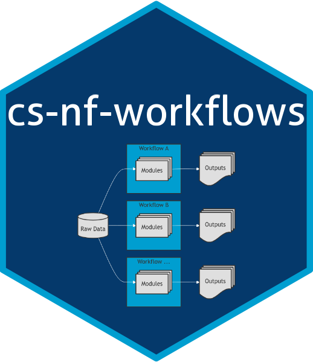

# JAX NGS Operations Nextflow DSL2 Pipelines

This repository contains production bioinformatic analysis pipelines.

## Pipeline Level Documentation, Quick Start, and Developer Documentation: 

Please see the [Wiki documentation](https://github.com/TheJacksonLaboratory/cs-nf-pipelines/wiki) associated with this repository for all documentation.