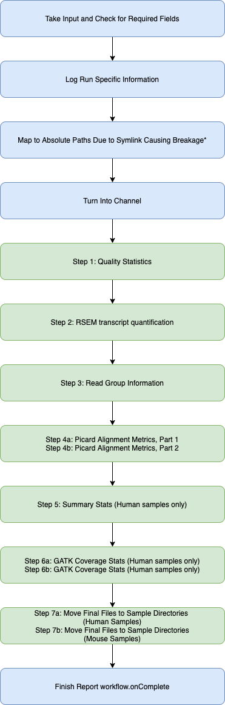
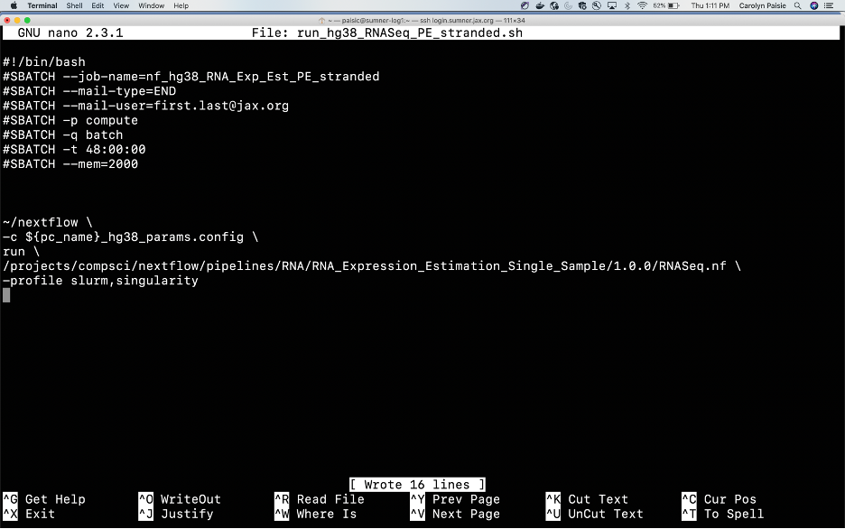

# RNASeq Pipeline

This RNASeq pipeline has been optimized for use on Sumner HPC. Thanks to the modular nature of Nextflow and our Singularity container it is easy to repurpose the code to be used in the cloud or on alternative servers.

This introduction will first cover a use case on Sumner. See the Quick Start section for a brief walk through. We will then cover some of the necessary configuration changes required on separate systems, though this will not be an exhaustive explanation.

For further details into the structure of the <a href = '#'>Singularity container used please see the documentation here.</a>

You must also have Nextflow Version $$$ loaded into your home directory. <a href = '#'>See here for how to install Nextflow.</a>
<hr>
<h2>Background</h2>
Before jumping into too much detail please be aware of the basic use of Nextflow and Singularity. Here are some quick links to learn more:
<ul>
<li><a href = "#">About Nextflow</a></li>
<li><a href = "#">About Singularity</a></li>
</ul>
<hr>
<h2>User Process (High Level)</h2>

<center>


</center>
figure 1
<hr>
<h2>RNASeq Nextflow Script Process (High Level)</h2>

<center>



</center>

figure 2
<hr>
<h2>Singularity Container</h2>

Our Singularity container is hosted on Quay.io at $$$. The Nextflow script will use your cached credentials for Quay.io or you will need to udate $$$.config. You will also need access to this container in order to run the pipeline.

The tools that are available in this container are: * could also break down by function if necessary
<ul>
<li>OS = $$$</li>
<li>bowtie2</li>
<li>...</li>
</ul>

Note: For exact versioning of tools you will need to see the release information for Singularity container version you are using.
<hr>
<h2>Quick Start on Sumner</h2>
<h3>System Requirements</h3>
<ul>
<li>Access to Sumner HPC</li>
<li>Nextflow Version 21.04 or later in home directory. (<a href = '#'>For instillation see this link</a>)</li>
<li>module load singularity (requires being on a compute node)</li>
<li>A clean working directory</li>
<li>This folder of the reopo must be present on the file system</li>
<li>Access to our Quay.io Singularity containers</li>
</ul>

<h3>Preliminary File Requirements</h3>
<ul>
<li>FASTQ files in an accessible folder named per convention:
  <ul>
  <li>*_R1*.fastq.gz (forward read)
  <li>*_R2*.fastq.gz (reverse read, if doing paired-end)
  </ul>
</ul>
<hr>
<h3>Part A:<br>Login to Sumner</h3>

```bash
  ssh login.sumner.jax.org
```
<hr>
<h3>Part B:<br>Pull this Repo and Move Some Files</h3>

Pull this repo from bitbucket and be sure to copy the shell scripts in this folder to your working directory.
```bash
git clone https://bitbucket.jax.org/scm/~sandeb/nf_dsl2_testing.git
```
This script will deposit all output into the current working directory in which it is run.

Please make sure that the following shell scripts are in the working directory you wish to proceed in.
<ul>
<li>run_hg38_RNASeq_PE_stranded.sh</li>
<li>make_hg38_config_run_RNASeq_PE_stranded.sh</li>
</ul>

```bash
cp run_hg38_RNASeq_PE_stranded.sh [/your/working/directory]/run_hg38_RNASeq_PE_stranded.sh
cp make_hg38_config_run_RNASeq_PE_stranded.sh [/your/working/directory]/make_hg38_config_run_RNASeq_PE_stranded.sh
```

<hr>

<h3>Part C:<br>Edit run_hg38_RNASeq_PE_stranded.sh</h3>
This file is responible for setting up the Slurm job and running the Nextflow command.
<br><br>
Change the email from first.last@jax.org to match your name or jax email.
<br><br>

```bash
cd [/your/working/directory]
nano run_hg38_RNASeq_PE_stranded.sh
```

<center>



</center>
<hr>

<h3>Part D:<br>Run Script</h3>
You have completed the setup, now it is time to run the script and submit the job to slurm. Below is a sample command that you can run to test the environment.

```bash
sbatch make_hg38_config_run_RNASeq_PE_stranded.sh /projects/compsci/USERS/paisic/hsa_fastq_RNA_seq/PE /projects/compsci/USERS/paisic/hsa_hg38_RNASeq_testing_PE/ /fastscratch/paisic/hsa_hg38_RNASeq_testing_PE/ 50 PE stranded 25
```

<hr>

<h3>What Did We Ask the System to Do?</h3>
<hr>

<h3>Expected Outputs</h3>
<hr>
<h3>All Optional Inputs</h3>
<hr>
<h3>Config On Other Systems</h3>
<hr>
